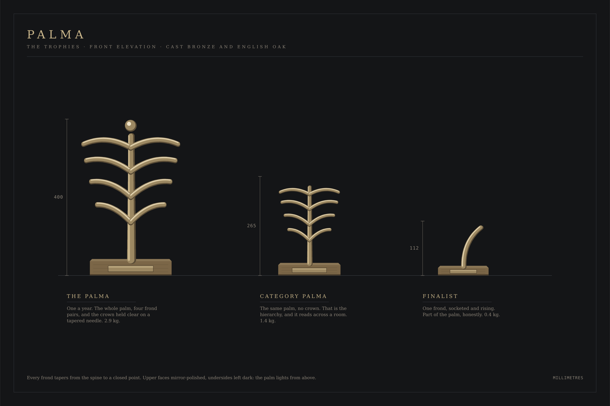
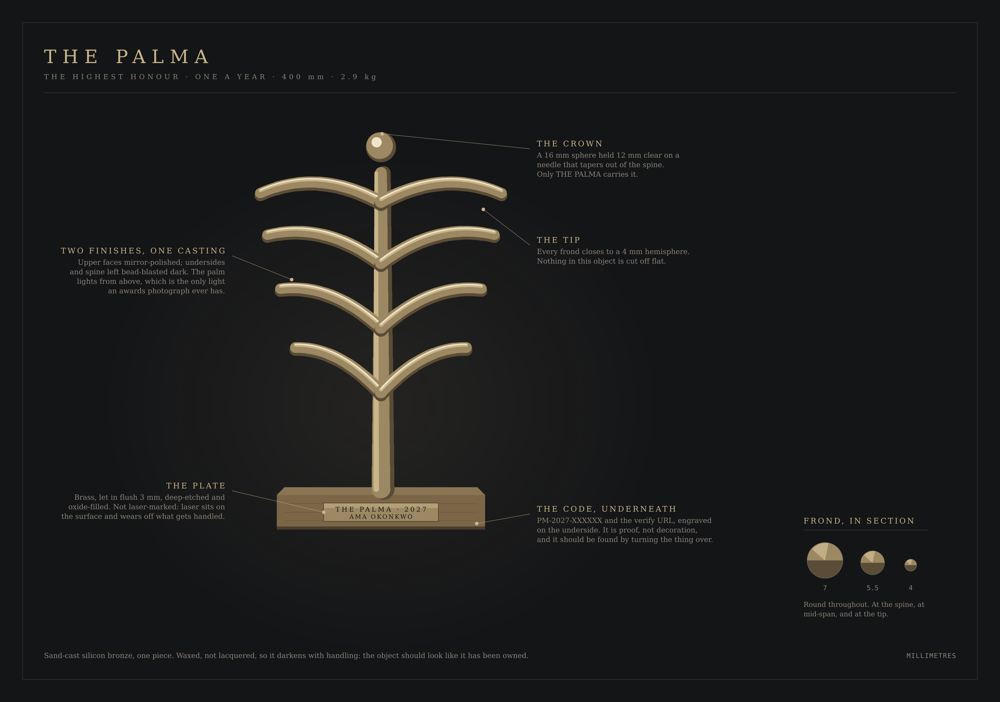

# The PALMA trophies

A brief a foundry can quote from. Every dimension, alloy and finish is stated,
and the drawings are generated from the same palm geometry the website uses, so
the object and the mark cannot drift apart.



---

## The idea the family rests on

Three objects, one palm, and the hierarchy is **what you are given of it**:

|                    | What it carries                                      |
| ------------------ | ---------------------------------------------------- |
| **THE PALMA**      | The whole palm, four frond pairs, **and the crown**. |
| **Category PALMA** | The same palm. **No crown.**                         |
| **Finalist**       | **One frond.**                                       |

That is the whole system, and it reads across a room in a photograph, which is
where most people will ever see these. Nobody has to be told which is which.

The crown matters because on the mark it is not a leaf: it is a struck dot held
clear above the spine. Making it the thing only the highest honour carries turns
a drawing convention into the most valuable 16 mm of bronze in the institution.

### What the first version got wrong

It was a figure on a plinth, which is what every corporate award has been for
thirty years, and the hierarchy between the two trophies was a materials
difference (full round against half relief) that nobody would notice and no
photograph would show. Both are gone.

---

## THE PALMA

**400 mm · 2.9 kg · one a year · never shared**



### The palm

- **Material.** Silicon bronze, sand-cast, **one piece**. Not plated, not resin,
  not a bronze-coloured finish. The weight is part of the object.
- **Height.** 288 mm, spine socket to the top of the crown.
- **Spine.** Round section, **22 mm** at the socket tapering to **6 mm** where
  the needle leaves it. Circular throughout, so it feels the same in the hand
  from any angle.
- **Fronds.** Four opposed pairs, each a swept round rod of **7 mm** at the
  spine, 5.5 mm at mid-span, closing to a **4 mm hemisphere** at the tip.
  Nothing on this object is cut off flat. The lowest pair spans 150 mm tip to
  tip and each pair above gains 12 mm, so the crown pair spans 186 mm.
- **The crown.** A **16 mm** sphere held **12 mm clear** of the spine on a
  needle that tapers out of it, finishing at 3 mm. It should read as struck and
  separate. Only THE PALMA carries it.

### Two finishes, one casting

The single decision that makes this object photograph:

- **Upper faces of the fronds and the crown:** hand-polished to a mirror.
- **Undersides, spine and needle:** fine bead-blast, left dark under patina.

An awards photograph has one light, and it is overhead. A uniformly polished
palm turns into a flare; a uniformly dark one disappears. This one lights along
its upper edges and holds its shape, which is what the engraved mark does on
paper.

Patina: warm mid-brown, **waxed rather than lacquered**. It will darken with
handling over years, and that is correct. The object should look like it has
been owned.

### The block

- **English oak**, quarter-sawn so the medullary rays show as figure.
  Sustainably sourced, supplier named on the certificate.
- **168 × 168 × 34 mm.** One block, not a tiered plinth. A trophy on stacked
  slabs reads as a wedding cake.
- **2 mm hand-worked chamfer** on every arris. No radius, no bullnose.
- Hard-wax oil, matt. Not lacquer, not gloss.
- Ballasted from beneath with brass if the finished piece comes in under
  **2.4 kg**. Heft is the difference between an award and a souvenir.

### The plate

Let into the front face **flush at 3 mm**, so a fingertip crossing it feels an
edge and not a step. Solid brass, 1.5 mm, satin, **192 × 30 mm**.

Deep-etched and oxide-filled in ink black — **not laser-marked**. Laser marking
sits on the surface and wears off a plate that gets handled, and this one will
be handled for decades.

```
              THE PALMA · 2027
                AMA OKONKWO
```

### The code, underneath

`PM-2027-XXXXXX · palmaawards.com/verify` engraved on the **underside** of the
block. It is proof, not decoration, and it should be found by somebody who turns
the object over looking for it.

---

## The Category PALMA

**265 mm · 1.4 kg · one per category**

The same palm, the same casting process, the same two finishes, at **175 mm**.
**No crown:** the spine tapers and simply ends.

- Block: English oak, **128 × 128 × 26 mm**, same chamfer and finish.
- Plate: brass, let in flush, 70 mm wide, carrying the category, the year and
  the winner.
- Code on the underside, as above.

### Where a sponsor may and may not appear

A category may be presented by a partner. If it is, the partner's name appears
**on the certificate and in the programme, never on the trophy.** The object in
a winner's hands carries PALMA's mark, the category, the year and their name,
and nothing that was paid for.

This is not a style preference. It is the same line the software enforces: a
sponsor buys association with the category, not a share of the recognition.

---

## The finalist frond

**112 mm · 0.4 kg**

One frond, socketed into a small oak block at **62°** so it leaves the block
steeply and opens as it rises. Cast brass rather than bronze, polished along the
upper arris like its larger siblings.

A frond _pair_ laid flat was the first attempt and it read as a moustache. One
frond reads as what it is: a part of the palm, given to somebody who was part of
the season.

- Block: English oak, **104 × 104 × 20 mm**.
- Plate: brass, 54 mm, carrying the category, the year and the name.

Being a PALMA finalist is meant to be worth something on its own, and a
medallion in a box is not something anybody puts on a shelf.

---

## The certificate, for all three

A5 landscape, 300 gsm mould-made cotton, letterpressed in ink black with the
palm **blind-embossed** — no ink, pressure only — at 42 mm.

Two signatures: the chair of the panel and one administrator, which is the same
two-person rule the software applies to conferral. The verification code is set
at the foot in monospace with the verify URL beneath it.

Blind embossing is the detail worth paying for. It cannot be photocopied, it
cannot be reproduced by a home printer, and it is felt before it is seen.

---

## What none of these are

- **Not crystal-and-chrome.** The bevelled acrylic obelisk is the corporate
  award of the last thirty years, and PALMA's whole position is that it is not
  that kind of institution.
- **Not gold plated.** Plating chips, and a chipped award is worse than a plain
  one. Solid brass and bronze age; plate fails.
- **Not resin, anywhere.** If cost pressure forces a change, the correct answer
  is fewer categories, not a lighter object.
- **Not engraved after the fact.** The name goes on before the ceremony, which
  means the winner is known to the workshop before the room. The foundry holds
  that under the same terms as the panel.

---

## The drawings

`docs/trophies/` holds both sheets as PNG and SVG, and the two scripts that
generate them.

```
node docs/trophies/draw-elevation.mjs   # the three, to scale
node docs/trophies/draw-detail.mjs      # THE PALMA, with callouts
```

They import the palm paths from the same source the site renders — see
`src/components/brand/geometry.ts`. **Redraw rather than retouch.** A trophy
drawing edited by hand is how the object and the mark quietly stop being the
same palm, which has already happened once to this institution's logo.
